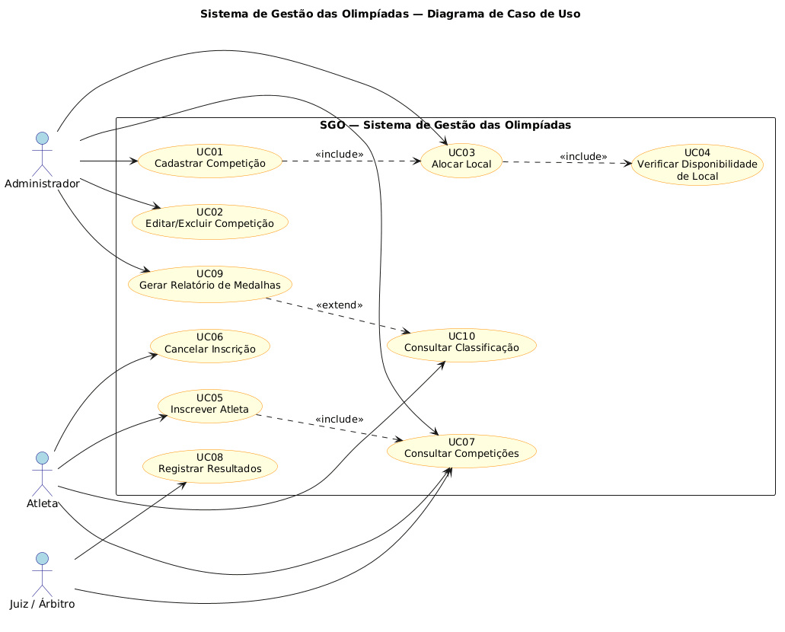
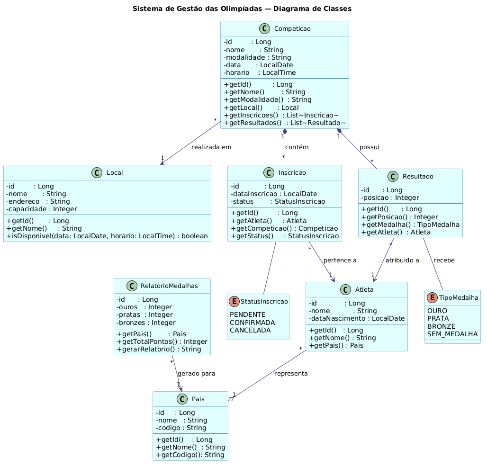
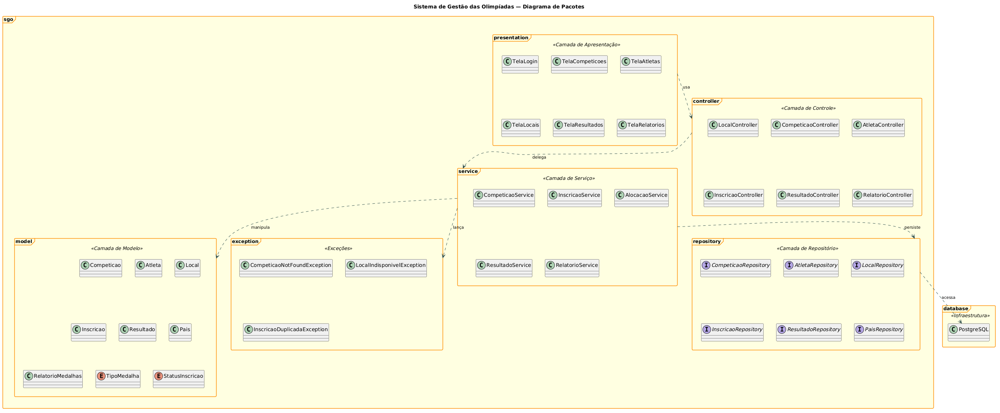
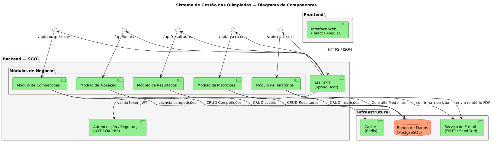
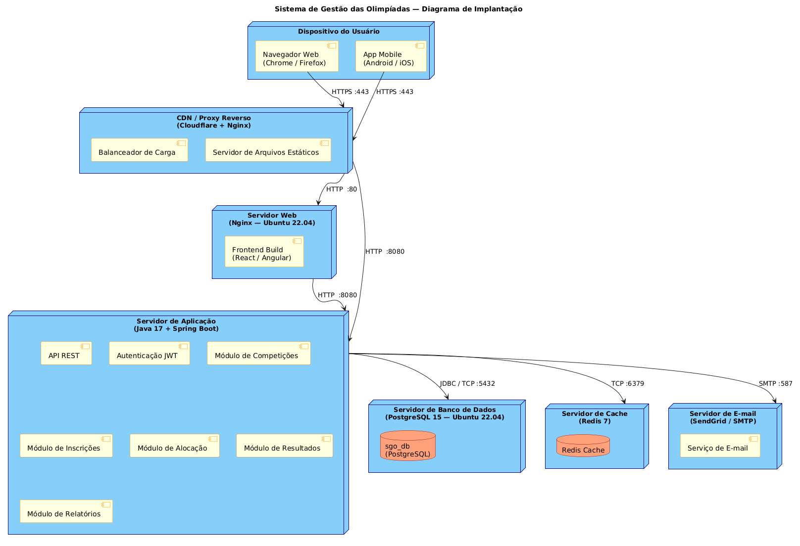

# 🏅 SGO — Sistema de Gestão das Olimpíadas

> Trabalho 1 — Projeto de Software | Engenharia de Software | 4º Período  
> Professor: João Paulo Carneiro Aramuni

---

## 📋 Descrição do Sistema

O **Sistema de Gestão das Olimpíadas (SGO)** é uma plataforma desenvolvida para coordenar os diferentes aspectos de um evento olímpico. O sistema permite o gerenciamento de competições, inscrições de atletas, alocação de locais para as provas e controle de resultados, além de gerar relatórios de medalhas por país.

---

## 📌 Regras de Negócio

1. **Cadastro de Competições:** O sistema permite cadastrar competições contendo nome da modalidade, data, horário, local e lista de atletas inscritos.
2. **Inscrição de Atletas:** Atletas de diferentes países podem se inscrever em competições específicas. Cada atleta pode participar de várias competições, mas só pode representar um país por modalidade.
3. **Alocação de Locais:** Os locais são alocados evitando conflitos de horário. Um local só pode abrigar uma competição por vez.
4. **Controle de Resultados:** Após cada competição, os resultados são registrados determinando o 1º, 2º e 3º lugares.
5. **Relatórios de Medalhas:** O sistema gera relatórios mostrando o desempenho de cada país com base nas medalhas de ouro, prata e bronze conquistadas.

---

## 👤 Histórias de Usuário

| ID   | Como...        | Quero...                                                                          | Para...                                                    |
|------|----------------|-----------------------------------------------------------------------------------|------------------------------------------------------------|
| US01 | Administrador  | Cadastrar uma competição informando nome, modalidade, data, horário e local       | Que ela esteja disponível para inscrições                  |
| US02 | Administrador  | Editar ou excluir uma competição cadastrada                                       | Manter as informações sempre atualizadas                   |
| US03 | Administrador  | Alocar um local para uma competição verificando disponibilidade de horário        | Evitar conflitos de agenda entre competições               |
| US04 | Atleta         | Me inscrever em uma competição específica                                         | Participar do evento olímpico representando meu país       |
| US05 | Atleta         | Cancelar minha inscrição em uma competição                                        | Liberar minha vaga caso não possa participar               |
| US06 | Atleta         | Consultar as competições disponíveis                                              | Verificar datas, horários e locais das provas              |
| US07 | Atleta         | Consultar a classificação de uma competição                                       | Acompanhar meu desempenho e o de outros participantes      |
| US08 | Juiz / Árbitro | Registrar os resultados de uma competição informando 1º, 2º e 3º lugares         | Que as medalhas sejam atribuídas corretamente              |
| US09 | Administrador  | Gerar um relatório de medalhas por país                                           | Visualizar o desempenho geral de cada nação nas Olimpíadas |
| US10 | Administrador  | Verificar a disponibilidade de um local em determinada data e horário             | Garantir que não haja conflito entre competições           |

---

## 🗂️ Diagramas UML

### 🎯 Diagrama de Caso de Uso



---

### 🧱 Diagrama de Classes



---

### 📦 Diagrama de Pacotes



---

### ⚙️ Diagrama de Componentes



---

### 🖥️ Diagrama de Implantação



---

## 📁 Estrutura do Repositório

```
sistema-gestao-olimpiadas/
│
├── README.md
│
├── codigos/
│   ├── diagrama-de-caso-de-uso.puml
│   ├── diagrama-de-classes.puml
│   ├── diagrama-de-pacotes.puml
│   ├── diagrama-de-componentes.puml
│   └── diagrama-de-implantacao.puml
│
└── imagens/
├── diagrama-de-caso-de-uso.png
├── diagrama-de-classes.png
├── diagrama-de-pacotes.png
├── diagrama-de-componentes.png
└── diagrama-de-implantacao.png
```

---

## 🛠️ Tecnologias Utilizadas

| Tecnologia | Finalidade                  |
|------------|-----------------------------|
| PlantUML   | Modelagem dos diagramas UML |
| GitHub     | Versionamento e entrega     |

---

## 📚 Referências

- [PlantUML — Site Oficial](https://plantuml.com/)
- [PlantUML — Guia Completo](https://plantuml.com/guide)
- [PlantUML API — Prof. Aramuni](https://github.com/joaopauloaramuni/projeto-de-software/tree/main/PROJETOS/Python/Projeto%20PlantUML%20API)

---

## 👨‍🎓 Autores

| Nome          | Matrícula |
|---------------|-----------|
| Matheus Felipe Correa | 860725    |
| Alice Shikida | 844663    |

> Curso: Engenharia de Software — 4º Período  
> Disciplina: Projeto de Software  
> Professor: João Paulo Carneiro Aramuni
